# Home Automation and IP Cameras

<!-- https://www.heise.de/developer/artikel/Kommunikation-ueber-MQTT-3238975.html

hier mal eine kleine Anleitung, um die Open Source Automatisierungssoftware openHAB zu benachrichtigen, wenn eine Bewegung bei der Instar-Kamera stattfindet.
Ich verwende folgende Komponenten:
• IN 9088 FullHD (geht mit allen Instars, die einen Alarmserver konfigurieren können)
• openHAB in Form vom Openhabian-Image für den Raspberry Pi
• Mosquitto MQTT Server (schon vorinstalliert bei Openhabian)
• Node-Red (ebenfalls vorinstalliert bei Openhabian)

Ablauf:
1) MQTT Server aktivieren: (sudo openhabian-config -> optional Components -> Mosquitto) https://www.youtube.com/watch?v=7YR0xwyBJ2E
2) Node-Red aktivieren (sudo openhabian-config -> optional Components -> NodeRED)
3) Flow anlegen und folgendes importieren, um von HTTP GET (Instar Alarmserverkonfig.) auf MQTT Publish (brauchbar mit openHAB) umzuwandeln (Screenshot):

[{"id":"2dc67579.0dceda","type":"http in","z":"db1545e9.9e99f8","name":"Instar Cam 1","url":"/instar1","method":"get","upload":false,"swaggerDoc ":"","x":530,"y":260,"wires":[["fb3f1441.6d2008"]],"outputLabels":["123"]},{"id":"fb3f1441.6d2008","type":"mqtt out","z":"db1545e9.9e99f8","name":"instarPub","to p ic":"/instar","qos":"1","retain":"","broker":"f92e2ffa.b a5a4","x":860,"y":400,"wires":[]},{"id":"f92e2ffa.ba5a4","type":"mqtt-broker","z":"","name":"openHAB-MQTT","broker":"localhost","port":"1883","clientid ":"node-red_MQTT","usetls":false,"compatmode":true,"keepal ive":"60","cleansession":true,"birthTopic":"","bi r thQos":"0","birthPayload":"","closeTopic":"","clos eQos":"0","closePayload":"","willTopic":"","willQo s":"0","willPayload":""}]

4) Alarmserver in der Instar-Kamera konfigurieren (Screenshot)
5) Mit MQTT die Topic "/instar" subscriben und testen, ob was ankommt (zb mit MQTTfx für Windows)
6) In openHAB Item für MQTT-Topic "/instar" anlegen und rules definieren (zb IF Besitzer zu Hause AND zwischen 00:00 und 07:00 Uhr AND Alarm von Kamera 1 THEN send Telegram-Message mit Kamerabild an Handy)

-->

<!-- TOC -->

- [Home Automation and IP Cameras](#home-automation-and-ip-cameras)
  - [openHAB 2 on Windows](#openhab-2-on-windows)
    - [Prerequisites](#prerequisites)
    - [Installation](#installation)
  - [nodeRED on Windows](#nodered-on-windows)
    - [Installing Node.js](#installing-nodejs)
    - [Installing nodeRED](#installing-nodered)
    - [Run nodeRED](#run-nodered)
  - [Mosquitto on Windows](#mosquitto-on-windows)
    - [Installing Mosquitto](#installing-mosquitto)
    - [Testing the MQTT Server with MQTT.fx](#testing-the-mqtt-server-with-mqttfx)
  - [OpenHAB2 Configuration](#openhab2-configuration)
    - [Connect the MQTT Server to openHab2](#connect-the-mqtt-server-to-openhab2)
    - [Add Things](#add-things)
  - [Access your SmartHome Remotely](#access-your-smarthome-remotely)

<!-- /TOC -->


## openHAB 2 on Windows

The following instructions will guide you through the process of setting up [openHAB 2](https://www.openhab.org/docs/).

### Prerequisites

First we need to [Download](https://java.com/en/) and install the JAVA Development Kit (JDK or openJDK). Then add the JAVA_HOME System Environment Variable in Windows in the Control Panel:

`System and Security ➡️ System ➡️ Advanced System Settings ➡️ Environment Variables ➡️ System Variables`

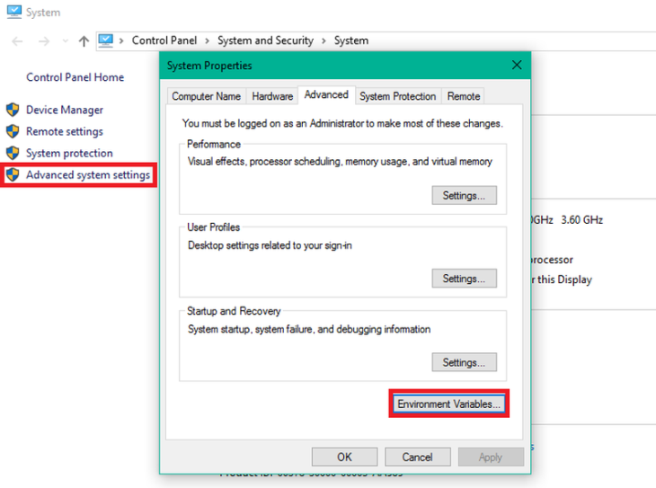


Open the Windows Control Panel, go to the __Advanced System Settings__ and open the __Environment Variables__.

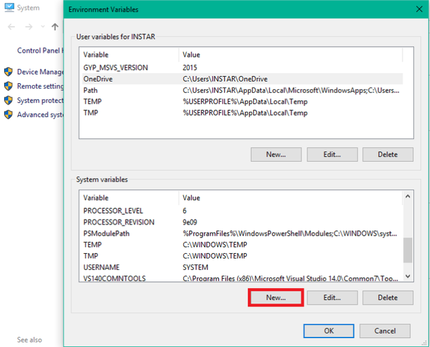


Select to set a new System variable __JAVA_HOME__ and point to your JAVA installation path (that _might differ_ from the one shown below): 

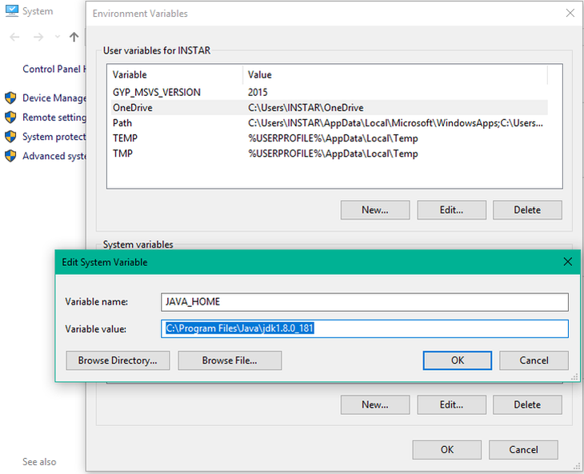


### Installation

[Download](https://www.openhab.org/download/) the latest Windows Stable or Snapshot ZIP archive file for manual installation and unzip the file in your chosen directory (e.g. `C:\openHAB2`).


To start the server launch the runtime by executing the script `C:\openhab230\start.bat`:

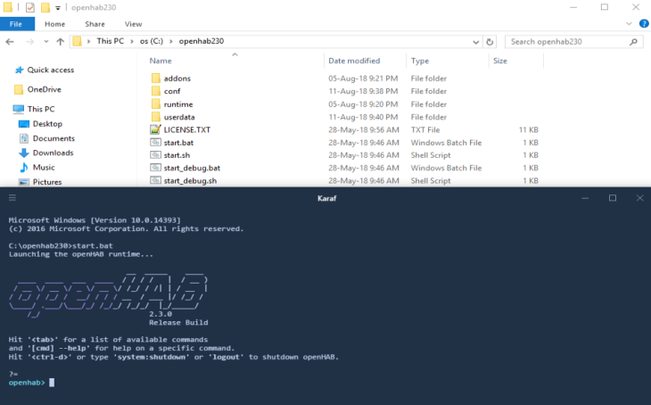


Point your browser to `http://localhost:8080`. You should be looking at the openHAB [package selection](https://docs.openhab.org/configuration/packages.html) page:

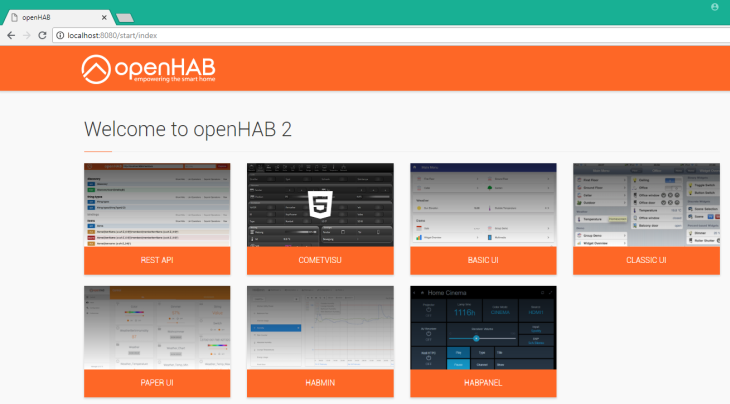


## nodeRED on Windows

Setting up [nodeRED](https://nodered.org) in a Microsoft Windows environment. The instructions are specific to Windows 10 but should also work for Windows 7 and Windows Server from 2008R2.


### Installing Node.js

Download the latest version of Node.js from the official [Node.js home](https://nodejs.org/en/) page. Run the downloaded MSI file. Installing Node.js requires local administrator rights. Once installed, open a command prompt and run the following command to ensure Node.js and npm are installed correctly:

`node -v && npm -v`

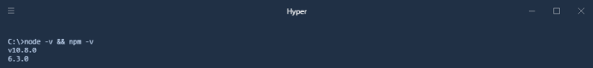


### Installing nodeRED

Installing nodeRED as a global module adds the command node-red to your system path. Execute the following at the command prompt:

`npm install -g --unsafe-perm node-red`


### Run nodeRED

Once installed, the simple way to run Node-RED is to use the node-red command in a command prompt: If you have installed Node-RED as a global npm package, you can use the node-red command:

`node-red`

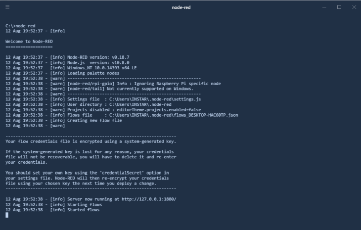


Point your browser to `http://localhost:1880/`. You should be looking at the nodeRED interface:

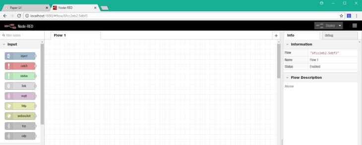


## Mosquitto on Windows

[Eclipse Mosquitto](https://github.com/eclipse/mosquitto) is an open source (EPL/EDL licensed) message broker that implements the MQTT protocol versions 3.1 and 3.1.1. Mosquitto is lightweight and is suitable for use on all devices from low power single board computers to full servers.

The MQTT protocol provides a lightweight method of carrying out messaging using a publish/subscribe model. This makes it suitable for Internet of Things messaging such as with low power sensors or mobile devices such as phones, embedded computers or microcontrollers.

### Installing Mosquitto

First we need to [Download](https://mosquitto.org/download/) the latest binary and execute it:

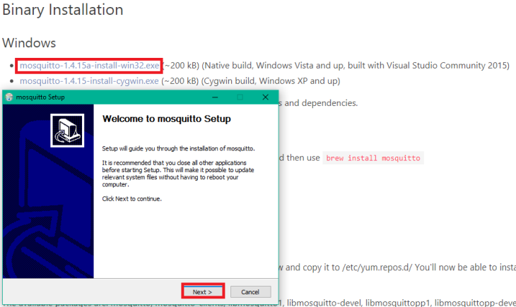


The Installer will ask to download and install the latest version of [Win32OpenSSL](http://slproweb.com/products/Win32OpenSSL.html) and copy all `.dll`'s to the Mosquitto install directory:

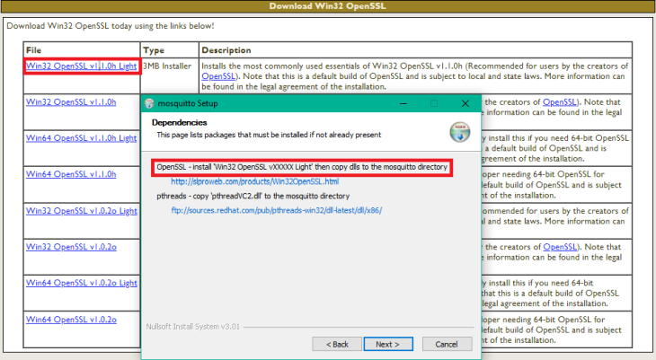

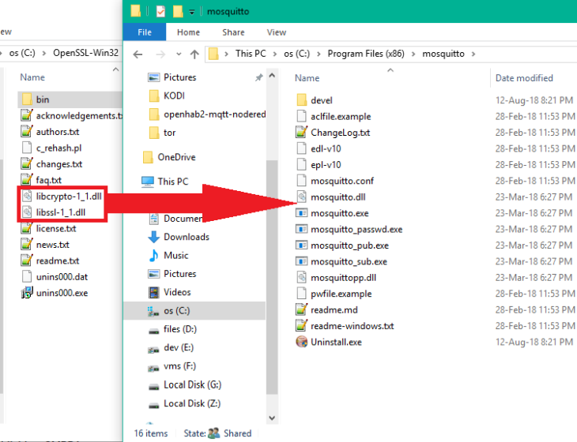


And the same with [this pthread.dll](ftp://sources.redhat.com/pub/pthreads-win32/dll-latest/dll/x86/):

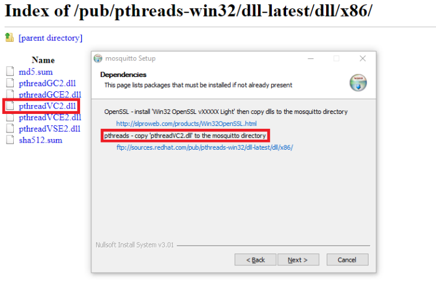

### Testing the MQTT Server with MQTT.fx

[Download MQTT.fx](https://mqttfx.jensd.de/index.php/download) as a MQTT Client for MQTT testing/debugging. Install and start the program and connect it to our local MQTT server:

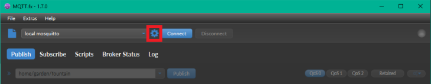

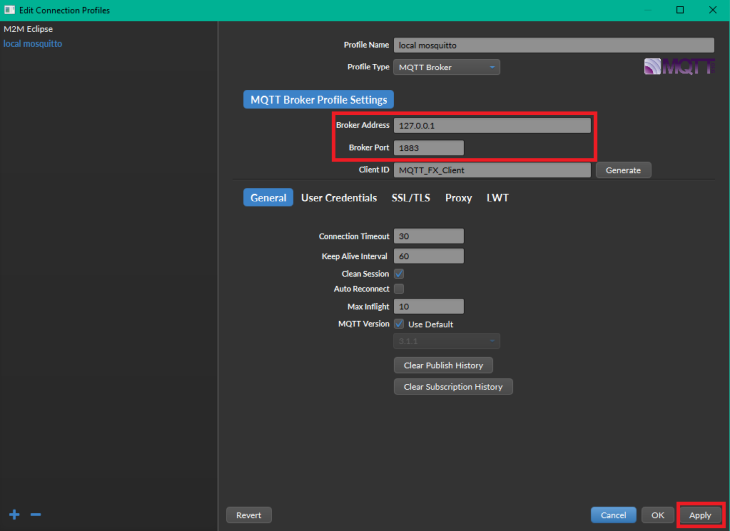

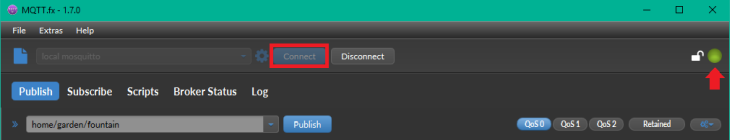


We can test the MQTT Service by __subscribing__:

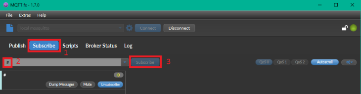

Going back to the __Publish__ tab and sending a message:

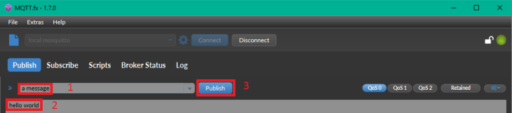

The message should show up in the __Subscribe__ tab:

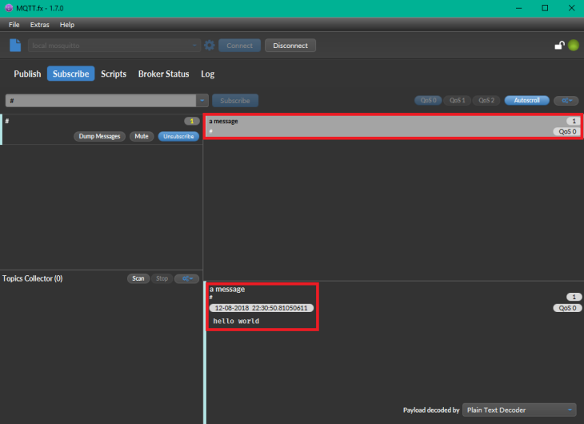


## OpenHAB2 Configuration

The configuration files for open hub can be found in the __./conf__ directory of the installation dir. First we want to configure the MQTT service to connect to our MQTT Server.


### Connect the MQTT Server to openHab2

Go back to `http://localhost:8080` and select the PaperUI, go to Add-ons and search for MQTT-bindings inside the __Bindings__ tab - in my case this was already installed, if not, hit install:

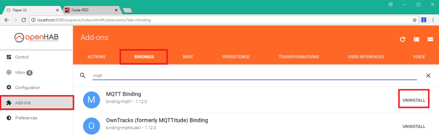


Now go to the openHAB2 install dir - if you followed this guide, this will be `C:\openhab230\conf\services` and open the __mqtt.cfg__:

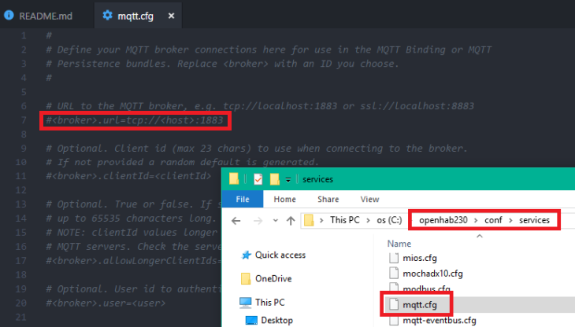

Add the MQTT URL as follows: `broker.url=tcp://localhost:1883`


### Add Things

Go to `C:\openhab230\conf\services` to create a configuration file named __office.things__ and add the following declaration _//This is the Things file_. Eventually we will populate this file with devices that require a thing declaration, keep in mind that not all devices need it.


To be able to access things - such as a light switch - we need to add them to an items file __office.items__ in `C:\openhab230\conf\items`. For demo purposes we can add a __Switch Item__:

```
// This is the Items File

//Demo items
Switch DEMOSW "Demo Switch"
```

In this case __Switch__ will be the type of item we add, __DEMOSW__ is it's name and __Demo Switch__ will be used as it's lable.


Now we have to add the switch to our user interface, by adding a __office.sitemap__ file in `C:\openhab230\conf\sitemap`. The sitemap file is how you interact with the devices or the user interface:


```
sitemap home label="INSTAR - SmartOffice"
{
       Frame label="Demo"
       {
               Switch item=DEMOSW
       }
}
```

To activate the sitemap go to __Configuration__ and __Services__, choose __UI__ and select to configure the __Basic UI__:


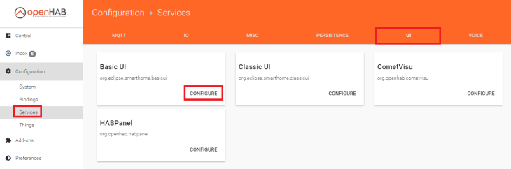

Type in the name of your sitemap - we used __office__ - and click __Save__. You can then repeat this step with the __CLassic UI__:


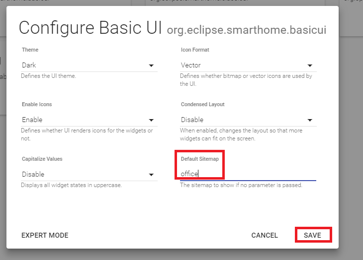

You can now open the __Basic UI__ in a new tab `http://localhost:8080/basicui/app` and see the switch we just created:


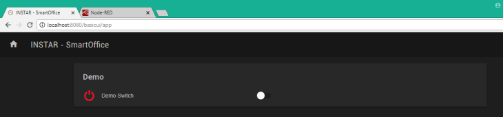

To add functionality to our switch, we need to add a __office.rules__ file in `C:\openhab230\conf\rules`. This is the file that does all the automation.


## Access your SmartHome Remotely


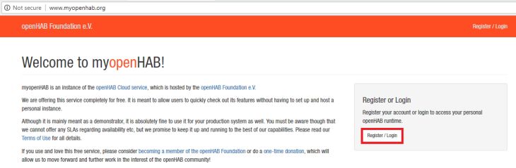


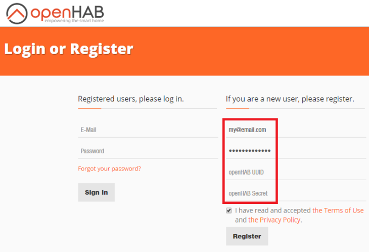

You can use the [OpenHAB Cloud](https://myopenhab.org/users) to access your Smarthome over the internet. Just use your Email Address and Password + __UUID__ and __Secret__ of your OpenHAB installation - the latter can be found under `./userdata/uuid` and `./userdata/openhabcloud/secret`


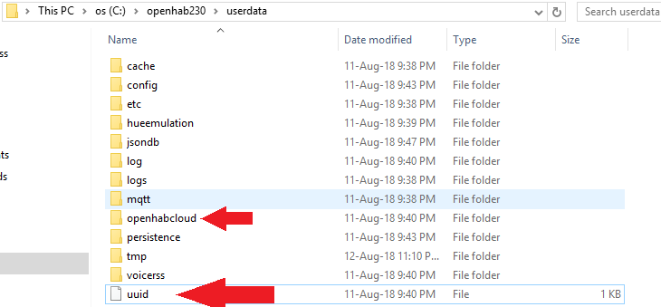


Go back to to [MyOpenHAB](https://myopenhab.org/), make sure that you are logged in, and you will see a __Online__ notification on the top right - if not, stop and restart the OpenHAB service from your console and refresh the webpage. 

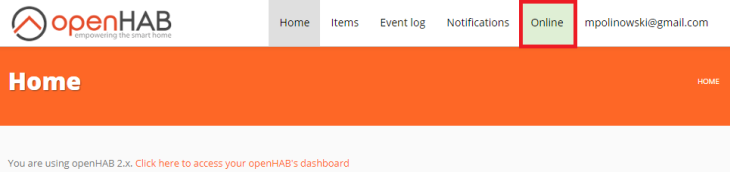


You will see the familiar UI when you navigate to https://home.myopenhab.org/start/index. You can use this login on the web, on [Android](https://play.google.com/store/apps/details?id=org.openhab.habdroid), [iOS](https://itunes.apple.com/us/app/openhab/id492054521?mt=8) and [Window Phone / Metro](https://www.microsoft.com/en-us/p/openhab/9nmq39ctwxgt).